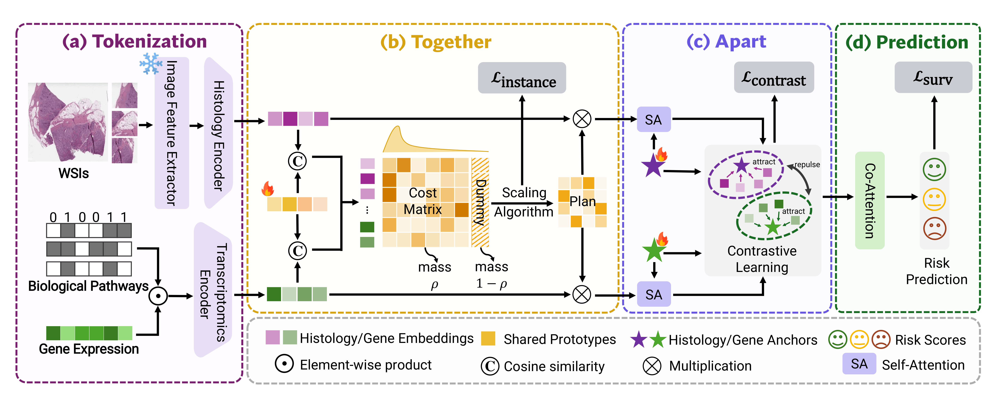

<div align="center">

<h1>Together, Then Apart:<br/>Balancing Alignment and Distinctiveness for Multimodal Survival Analysis</h1>

<p>
  <a href="https://liuwj003.github.io/">Wenjing Liu</a><sup>1,2,*</sup>&nbsp;
  <a href="https://soonera.github.io/qinren/">Qin Ren</a><sup>1,*</sup>&nbsp;
  <a href="https://kkwenz.github.io/">Wen Zhang</a><sup>1,3</sup>&nbsp;
  <a href="https://ywlincq.github.io/">Yuewei Lin</a><sup>4</sup>&nbsp;
  <a href="https://chenyuyou.me/">Chenyu You</a><sup>1</sup>
</p>

<p>
  <sup>1</sup>Stony Brook University &nbsp;
  <sup>2</sup>Stanford University &nbsp;
  <sup>3</sup>Johns Hopkins University &nbsp;
  <sup>4</sup>Brookhaven National Laboratory<br/>
  <sup>*</sup>Equal contribution
</p>

<p>
  <a href="https://arxiv.org/pdf/2511.18089">
    
  </a>
  <a href="https://y-research-sbu.github.io/TTA/">
    
  </a>
  <a href="https://github.com/Y-Research-SBU/TTA">
    
  </a>
  <a href="https://huggingface.co/datasets/LIUWJ/Data_TMI">
    
  </a>
</p>

</div>

---

## Method

TTA is a multimodal survival framework for whole-slide images and transcriptomics. **Together** aligns shared prognostic structure through a common prototype bank and joint unbalanced optimal transport; **Apart** preserves complementary, modality-specific evidence with anchor-guided contrastive regularization. The resulting representations are fused for survival prediction.



## Repository Structure

```text
.
|-- env.yaml                  # conda environment
|-- data/                     # local WSI feature root
|-- docs/                     # GitHub Pages project website
`-- TTA/                      # runnable code
    `-- src/
        |-- scripts/          # reference run scripts and default TTA config
        |-- training/         # training and evaluation entry points
        |-- mil_models/       # TTA model and fusion modules
        |-- wsi_datasets/     # WSI/omics survival dataset loaders
        |-- utils/            # losses and helper utilities
        |-- splits/           # survival split files
        |-- data_csvs/        # omics metadata and RNA CSVs
        `-- results/          # example outputs and default run directory
```

The runnable code is under `TTA/src`. The root-level `data/` directory is the default location for local WSI feature folders.

## Installation

Create the conda environment from the repository root:

```bash
conda env create -f env.yaml
conda activate tta
```

## Data Preparation

The code expects two data sources:

- WSI patch features in `.h5` or `.pt` format.
- Omics CSV files and survival split CSVs used by the training pipeline.

### WSI Features

Preprocessed WSI features are available from [LIUWJ/Data_TMI](https://huggingface.co/datasets/LIUWJ/Data_TMI). The release contains feature files extracted with UNI and ResNet-50 encoders. UNI features are extracted with the UNI preprocessing pipeline provided by [mahmoodlab/TRIDENT](https://github.com/mahmoodlab/TRIDENT).

Place downloaded features under the root-level `data/` directory:

```text
data/
  tcga_brca_uni/
    extracted_mag20x_patch256_fp/
      uni/
        feats_h5/
          <slide_id>.h5
```

For ResNet-50 features, use the corresponding feature folder:

```text
data/
  tcga_brca_resnet50/
    extracted_mag20x_patch256_fp/
      resnet50/
        feats_h5/
          <slide_id>.h5
```

The feature family is inferred from the task suffix in `TTA/src/scripts/survival/tta.sh`:

```text
*_uni_survival       -> uni
*_resnet50_survival  -> resnet50
```

The default WSI preprocessing convention is `mag=20x` and `patch_size=256`. The default input dimensions are `1024` for UNI features and `768` for ResNet-50 features.

### Splits and Omics CSVs

Survival splits and omics CSVs follow the organization used by [MMP](https://github.com/mahmoodlab/MMP). Place the split files under `TTA/src/splits/` and the omics files under `TTA/src/data_csvs/`, keeping the same directory structure and CSV format as MMP.

## Running Experiments

Run commands from the source directory:

```bash
cd TTA/src
```

Run BRCA with the default TTA configuration:

```bash
bash ./scripts/survival/brca_uni_surv.sh 0 tta
```

The first argument is the GPU id and the second argument is the experiment configuration script name. The command above calls:

```text
scripts/survival/tta.sh
```

To use a custom data location, pass it as the third argument:

```bash
bash ./scripts/survival/brca_uni_surv.sh 0 tta /path/to/data
```

or set:

```bash
export TTA_DATA_ROOT=/path/to/data
bash ./scripts/survival/brca_uni_surv.sh 0 tta
```

## Important Configuration Switches

Most experiment settings can be changed directly in `TTA/src/scripts/survival/tta.sh`. The table below lists the switches most relevant to the TTA pipeline and ablations.

### Core TTA Switches

| Argument | Main value | Description |
| --- | --- | --- |
| `modality_type` | `multi` | Use both WSI and omics modalities.|
| `fusion_type` | `coattn` | Apply co-attention over prototype tokens. `concat`, `sum`, and `mlp` are late-fusion alternatives. |
| `shared_prototypes` | `1` | Use one shared prototype bank for WSI and omics tokens in the Together stage. |
| `shared_proto_num` | `32` | Number of shared prototypes used by the main model. |
| `joint_ot_single_path` | `1` | Compute OT assignments once on concatenated WSI and omics tokens, then split assignments back by modality. Setting `0` computes modality-specific OT assignments separately. |
| `ot_mode` | `ubot` | Use unbalanced OT. `balanced` disables the semi-relaxed/unbalanced behavior; `ubot_fixed_rho` uses a fixed rho value; `kmeans` is the hard-assignment ablation. |
| `use_ot_as_weights` | `1` | Use OT-produced assignments as token-to-prototype aggregation weights. This changes how tokens are pooled into prototype tokens. |
| `enable_modality_refine` | `1` | Enable the Apart-stage modality-context refinement. |

**Reference pipeline.** UOT pseudo-label generation, instance-level soft CE, and multi-head Sinkhorn consistency are enabled for both WSI and omics in the released `tta.sh` configuration. These paths are fixed for the main model, with a consistency weight of `0.01` per modality.

### Ablation-Related Notes

- `fusion_type`: `coattn` is the main setting; `concat`, `sum`, and `mlp` are late-fusion variants.
- `ot_mode`: `ubot` is the main setting; `balanced`, `ubot_fixed_rho`, and `kmeans` correspond to OT assignment ablations.
- `use_ot_as_weights` and soft CE are different mechanisms: `use_ot_as_weights` changes token pooling weights, while soft CE adds an auxiliary training signal that encourages assignment logits to match OT pseudo labels.
- `num_heads<=1` disables the multi-head Sinkhorn consistency path.

### Additional Default Settings

The following values are default implementation and training settings used by the main experiments.

| Argument | Main value | Description |
| --- | --- | --- |
| `shared_proto_dim` | `256` | Shared prototype dimension. |
| `shared_tau` | `0.5` | Temperature for shared prototype assignment. |
| `ot_mix_coeff` | `0.5` | Mixing coefficient between softmax weights and OT weights. |
| `ot_kl_weight` | `0.1` | OT regularization weight. |
| `wsi_ce_weight` | `0.5` | WSI auxiliary CE weight. |
| `omics_ce_weight` | `0.5` | Omics auxiliary CE weight. |
| `modref_weight` | `0.5` | Modality-context refinement loss weight. |
| `modref_tau` | `0.1` | Modality-context refinement temperature. |
| `modref_layers` | `1` | Number of refinement layers. |
| `num_heads` | `5` | Number of Sinkhorn heads. |
| `label_num_coattn_layers` | `1` | Label/prototype co-attention depth. |
| `batch_size` | `32` | Training batch size. |
| `train_bag_size` | `4096` | WSI token sampling or padding size for training. |
| `val_bag_size` | `4096` | WSI token sampling or padding size for validation/testing. |
| `max_epochs` | `30` | Maximum number of epochs. |
| `lr` | `1e-4` | Learning rate. |
| `wd` | `1e-5` | Weight decay. |
| `opt` | `adamW` | Optimizer. |
| `lr_scheduler` | `cosine` | Learning-rate scheduler. |
| `warmup_epochs` | `15` | Warmup used with non-constant schedulers. |
| `dropout` | `0.3` | Dropout rate. |
| `loss_fn` | `cox` | Survival objective. |
| `grad_clip_norm` | `5.0` | Gradient clipping norm. |

## Outputs

By default, outputs are saved under:

```text
TTA/src/results/
```

Each run creates a timestamped directory:

```text
results/<task>/<k-fold>/<exp_code>/<exp_code>::<timestamp>/
```

Typical files include:

```text
config.json
train.log
summary.csv
summary.csv.json
test_results.pkl
all_dumps.h5
s_checkpoint.pth
```

After the fifth fold (`k=4`), fold-level summaries are aggregated under:

```text
results/<task>/k=agg/<exp_code>/
```

Example result files are included under `TTA/src/results/`.

## Citation

```bibtex
@inproceedings{liu2026together,
  title     = {Together, Then Apart: Balancing Alignment and Distinctiveness for Multimodal Survival Analysis},
  author    = {Liu, Wenjing and Ren, Qin and Zhang, Wen and Lin, Yuewei and You, Chenyu},
  booktitle = {Proceedings of the 19th European Conference on Computer Vision},
  year      = {2026}
}
```

## Acknowledgements

This codebase builds on [MMP: Multimodal Prototyping for Cancer Survival Prediction](https://github.com/mahmoodlab/MMP) and related open-source work in computational pathology and multimodal survival analysis.
